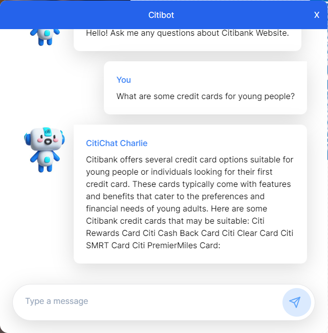
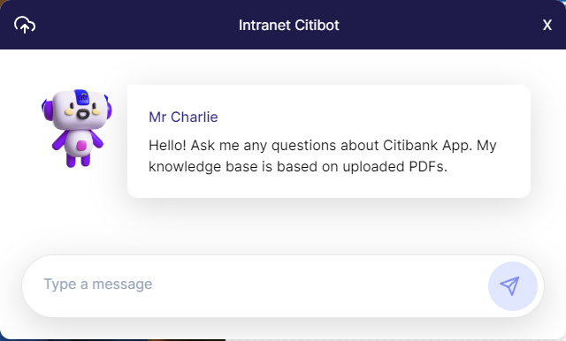

Citibot - Charlie

| Citibot                                               | Mr Charlie                                 |
| ----------------------------------------------------- | --------------------------------------------- |
|  ||

# Citibot - Demo
| Demo  |   
| ----------------------------------------------------- | 
|  |

# Citibot - Architecture
| Demo  |   
| ----------------------------------------------------- | 
|  |

## Description
Citibot - Charlie is an LLM chatbot designed for Knowledge Management in Banking. The banking sector relies heavily on complex enterprise applications, but the scattered nature of data makes it challenging to access, understand, and integrate information. This fragmentation results in inefficiencies that affect productivity. Citibot - Charlie is our solution to this problem, aiming to centralize application knowledge and provide instant answers on functionality, architecture, and other related aspects, enhancing the efficiency of information retrieval.

## Technologies Used
- 
- 
- 
- 
- 
- 
- 

## Installation
Ensure you have Node.js installed on your machine.
Clone the repository and navigate to the project directory.
Install the required dependencies.
Start the Next.js application.
Usage
Run the application.
Visit http://localhost:3000 to interact with the chatbot.
For backend functionalities, such as uploading data, visit http://localhost:3000/upsert.

## Features
Interactive 24/7 LLM customized data-trained CHATBOT.
Centralized database with Pinecone for efficient data retrieval.
User-friendly interface powered by Next.js and Tailwind.

## Contribution
If you wish to contribute to the project, please fork the repository and submit a pull request. We appreciate any contributions you might want to make.
